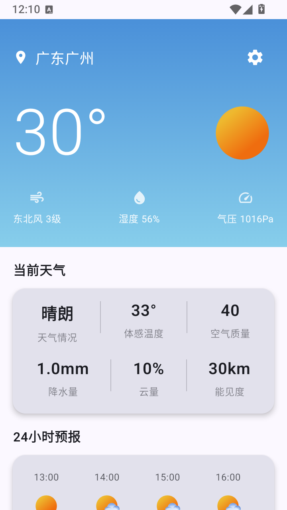
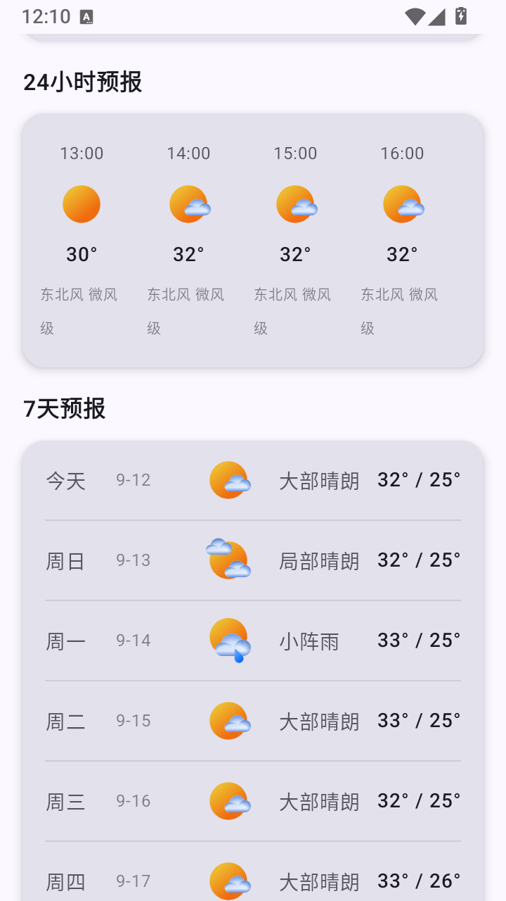

# Weather App

受够了国内那些广告满天飞的天气APP,自己写了个没有广告的简洁的天气APP。
api使用巨硬家的,可以精确到村级,安装后直接就可以使用。

## 功能特性

- 实时天气查询
- 多城市支持
- 天气预报展示
- 桌面小部件（小、中、大三种尺寸）
- 后台自动更新
- 位置权限支持

## 界面截图

<div align="center">
  
  
</div>

## 技术栈

- **Kotlin** - 主要开发语言
- **Jetpack Compose** - 现代 UI 框架
- **Hilt** - 依赖注入
- **Room** - 本地数据库
- **Retrofit** - 网络请求
- **WorkManager** - 后台任务
- **Coil** - 图片加载

## 项目结构

```
app/src/main/java/info/ggdog/weather/
├── data/           # 数据层（API、数据库、仓库）
├── domain/         # 业务逻辑层
├── presentation/   # UI层（Activity、Screen、ViewModel）
├── widget/         # 桌面小部件
└── util/           # 工具类
```

## 环境要求

- Android Studio Arctic Fox 或更高版本
- JDK 17
- Android SDK 34
- Min SDK 26 (Android 8.0)

## 构建运行

1. 克隆项目
```bash
git clone <repository-url>
```

2. 使用 Android Studio 打开项目并同步 Gradle

3. 运行应用到设备或模拟器

## 权限说明

应用需要以下权限：
- 网络权限 - 获取天气数据
- 位置权限 - 获取当前位置天气
- 后台运行权限 - 定时更新天气

## 版本信息

- Version: 1.0.0
- Min SDK: 26
- Target SDK: 34